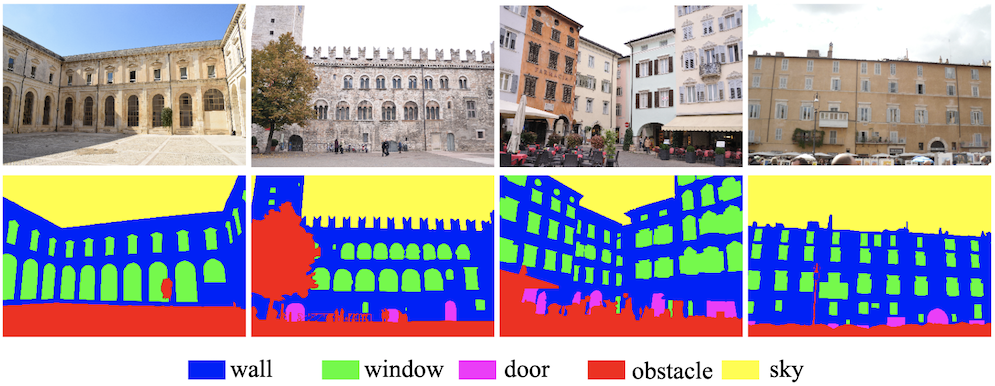

# 3DOM-Semantic-Facade 
benchmark dataset for facade semantic segmentation

### 1. Dataset Description

Datasets contain varying number of images (\*.jpg) 
suitable for MVS reconstruction and corresponding 
GT labels (\*_l.png)

|Dataset name  |  original resolution  | camera name |
|--|--|--|
| [Albergati, Bologna Portici] |4608 x 3072 |NIKON D3100|
| [Campidoglio, Chigi] |4416 x 3312 |Canon PowerShot G10|
| [Lecce Duomo, Lecce Teatini] |6000 x 4000 |NIKON D5300|
| Piazza Navona |4000 x 3000 |SAMSUNG ST45 (mobile)|
| Piazza Trento Duomo |6048 x 4032 |NIKON D3X|

*Note:* Piazza Navona class is not suitable for 3D reconstruction 
since images do not have sufficient overlap and some labels 
refer to the undistorted version of the image. 
Can be used for training purposes though. 

### 2. Class nomenclature
semantic labelling is performed manually.
Mixed color pixels occurring between class borders 
are given (0,0,0) value, i.e., black.

|class name  |  RGB values  |
|--|--|
| facade |(0,0,255) |
| window |(0,255,0) |
| door |(255,0,255) |
| sky |(255,255,0)|
| obstacle  |(255,0,0) |

If you use this dataset for your research, please cite our articles:

   
    
    @article{stathopoulou2019semantic,
      title={Semantic photogrammetry: boosting image-based 3D reconstruction with semantic labeling},
      author={Stathopoulou, EK and Remondino, F},
      journal={International rchives of the hotogrammetry, emote sensing and patial information ciences},
      volume={42},
      number={2},
      pages={W9},
      year={2019}
    }
    
    @article{stathopoulou2019multi,
      title={Multi-view stereo with semantic priors},
      author={Stathopoulou, E-K and Remondino, F},
      journal={International Archives of the Photogrammetry, Remote Sensing and Spatial Information Sciences},
      volume={42},
      number={2/W15},
      year={2019}
    }
    
    @article{stathopoulou2021semantically,
      title={Semantically derived geometric constraints for MVS reconstruction of textureless areas},
      author={Stathopoulou, Elisavet Konstantina and Battisti, Roberto and Cernea, Dan and Remondino, Fabio and Georgopoulos, Andreas},
      journal={Remote Sensing},
      volume={13},
      number={6},
      pages={1053},
      year={2021},
      publisher={Multidisciplinary Digital Publishing Institute}
    }
    
    @PhdThesis{stathopoulou2022PhD,
      title={Integrating scene priors in Multiple View Stereo},
      author={Stathopoulou, Elisavet Konstantina},
      year={2022},
      school={National Technical University of Athens}
    }
